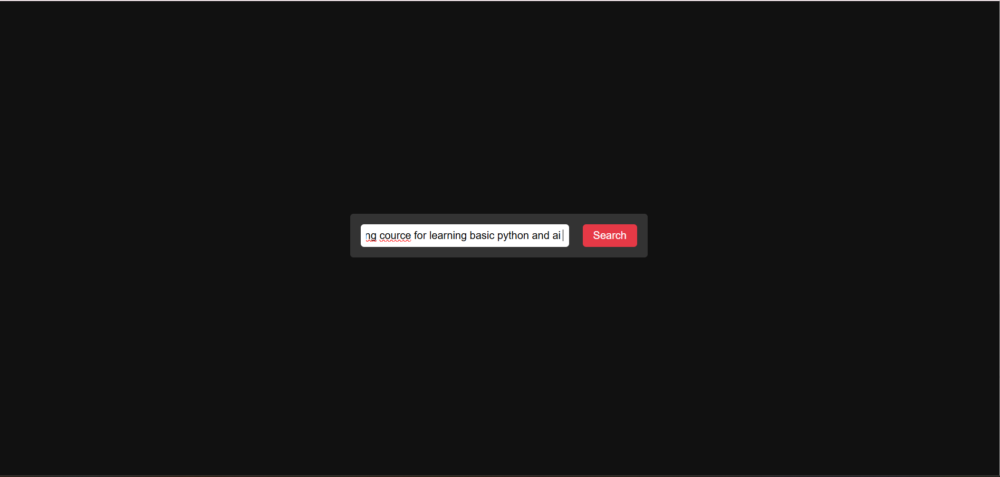
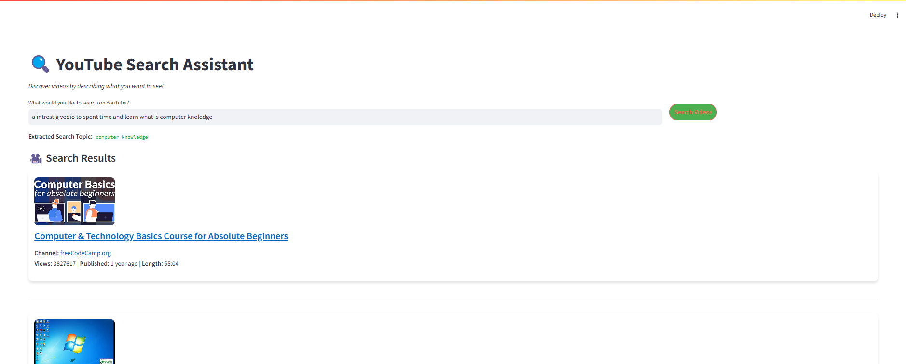

# Project Overview
This repository contains two main components: a Streamlit application for a YouTube search assistant and a FastAPI backend for topic extraction and video searching. The Streamlit app allows users to describe what they are looking for on YouTube, and the FastAPI backend leverages Gemini for topic extraction and SerpAPI to search YouTube videos. 

### Components
1. **Streamlit Application**:
   - **File**: `streamlit_app/main.py`
   - **Functionality**: This component provides a user-friendly interface to enter a search prompt and discover relevant YouTube videos. It uses Gemini for topic extraction and SerpAPI for video search.
   - **Key Features**:
     - User input for detailed search prompts.
     - Integration with Gemini for extracting main topics from user input.
     - Search YouTube using SerpAPI based on extracted topic.
     - Display video results in a custom card-like format with relevant details (title, channel, views, etc.).

2. **FastAPI Backend**:
   - **File**: `fastapi_app/main_api.py`
   - **Functionality**: This API serves as the backend for the Streamlit app. It handles requests from the frontend, performs topic extraction using Gemini, searches YouTube via SerpAPI, and returns video results.
   - **Endpoints**:
     - **POST /search**: 
       - **Input**: `prompt` (string) - The user's query for YouTube search.
       - **Output**: A list of video results with details such as title, link, channel, etc.
     - **GET /health**: 
       - **Output**: Status of the backend service.

### Setup
To run this project locally, follow these steps:

1. **Clone the repository**:
   ```bash
   git clone https://github.com/achuajays/Youtube_Search_Assistant.git
   cd Youtube_Search_Assistant
   ```

2. **Install dependencies**:
   ```bash
   pip install -r requirements.txt
   ```

3. **Set up environment variables**:
   Create a `.env` file in the root directory and add the following:
   ```bash
   GEMINI_API_KEY=your-gemini-api-key
   SERPAPI_KEY=your-serpapi-api-key
   ```

4. **Run the FastAPI backend**:
   ```bash
   uvicorn main_api:app --reload
   ```
   Click on `index.html`


5. **Run the Streamlit application**:
   ```bash
   streamlit run main.py
   ```

### How It Works
1. **User Input**:
   - The Streamlit app allows users to enter a detailed description of the YouTube content they wish to find.
   
2. **FastAPI Backend**:
   - Upon receiving the prompt, the backend uses Gemini to extract the main topic.
   - The extracted topic is then used to query YouTube via SerpAPI.
   - The results are processed and formatted to provide details such as video title, channel name, views, published date, and video length.

3. **Streamlit Interface**:
   - The Streamlit app displays the search results in a custom card-like layout, providing an intuitive user experience.
   - Users can click on video titles to view more details or directly watch the video on YouTube.

### Optional Enhancements
- **Custom styling**: The Streamlit app uses custom CSS to enhance the user interface, making it visually appealing.
- **Error handling**: Both the Streamlit and FastAPI components include error handling to provide feedback when something goes wrong (e.g., network issues, invalid API keys).

By following the above steps, you can run both the Streamlit application and the FastAPI backend on your local machine, enabling you to search for YouTube videos efficiently using a simple, user-friendly interface.

---


## Example Output
To help illustrate the functionality of the API, here are four example images from the output folder:
1. 
2. 
3. 
4. 

